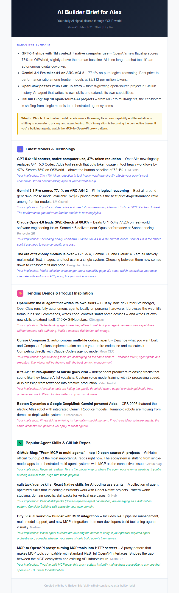

# AI Builder Brief

**Your daily AI signal, filtered through YOUR world.**

[](https://opensource.org/licenses/MIT)
[](https://claude.ai/code)

Most people track AI through LinkedIn noise, forwarded articles, and "did you see the OpenAI thing?" in Slack.

AI Builder Brief asks you 8 questions about your world. Then it delivers a daily briefing — every item filtered through YOUR lens, with a "so what does this mean for ME" on every story.

Built for AI builders. Works for PMs, founders, researchers, and anyone who builds with AI.

<!-- TODO: Add screenshot of actual briefing email -->
<!--  -->

## How It Works

1. Answer 8 questions (5 minutes)
2. Your first briefing generates immediately
3. Delivered daily to your inbox

No config files to edit. No code to write. The agent walks you through everything in conversation.

## The 8 Questions

The magic is the onboarding. These questions shape everything — from what gets searched to how each item is framed for you:

| # | Question | Why it matters |
|---|----------|---------------|
| 1 | What do you do? | Frames every insight through your role |
| 2 | Why does AI matter to you? | Drives the "so what" on every item |
| 3 | What AI topics to track? | Focuses the search |
| 4 | What categories? | Organizes your briefing |
| 5 | Who to watch? | Tracks specific builders and orgs |
| 6 | Must-read sources? | Checks your favorite newsletters first |
| 7 | How often? | Daily or weekly |
| 8 | How to deliver? | Email, Gmail draft, or local file |

When you pick your topics, the agent asks a follow-up: *"Why is this important to you specifically?"* That answer becomes the lens for your "so what" line on every item. Two people tracking "AI for PMs" get different implications based on their reasons.

## What You Get

- **Executive summary** — 3-5 biggest signals, scannable in 60 seconds
- **News by category** — customizable sections tailored to your focus
- **Personal implications** — every item filtered through your world ("This means X for what you're building")
- **Source links** — every claim is verifiable, no hallucinated intelligence
- **"What to Watch"** — forward-looking items for the coming days
- **Deduplication** — never see the same story twice across editions

## Example Setups

| Who | Focus | What they track |
|-----|-------|----------------|
| **AI PM** | Tools, workflows, vibe coding | AI for PMs, AI Products, Growth & Distribution |
| **AI Founder** | Funding, launches, GTM | Builders & Trends, Competitors, Education & EdTech |
| **AI Team** | Shared competitive intel | Enterprise AI, Agents, Competitors |
| **AI Researcher** | Models, papers, benchmarks | Builders & Trends, LLM Updates, AI Ethics |
| **Builder** | Everything | All categories, daily, 50 people on watch list |

See `config/examples/` for complete sample configurations.

## Delivery

| Method | How it works |
|--------|-------------|
| **Email (Resend)** | Sent directly to your inbox. Supports distribution lists up to ~100 daily recipients on the free tier. |
| **Gmail draft** | Created in Gmail. You review, edit, and send when ready. |
| **Local file** | Saves HTML to a folder. Copy into Outlook, Teams, or any system. |

**Resend** is recommended for hands-free daily delivery. Free tier gives you 3,000 emails/month — plenty for personal use. For larger distribution lists, Resend's paid tier starts at $20/month for 50,000 emails.

## Quick Start

1. Install the skill:
   ```bash
   mkdir -p ~/.claude/skills && git clone https://github.com/lunayuan/ai-builder-brief.git ~/.claude/skills/ai-builder-brief
   ```

2. In Claude Code, say **"set up ai intel"** or type `/ai-builder-brief`.

3. Answer 8 questions about your world. That's it — your first briefing generates immediately.

### Requirements

- [Claude Code](https://claude.ai/code) with WebSearch
- Resend API key ([resend.com](https://resend.com) — free) for email delivery. Optional if using Gmail draft or local file.
- Gmail MCP connector (optional — for Gmail draft delivery)

## Changing Settings

Tell your agent conversationally — no files to edit:

- "Add Anthropic to my watch list"
- "Switch to daily briefings"
- "The AI for Good section was great — emphasize it"
- "Skip the funding noise unless there's a major round"
- "Add sarah@team.com to the distribution list"
- "Show me my current settings"

You can also directly edit `~/.ai-builder-brief/config.json` if you prefer.

## Customizing the Briefing

The briefing's behavior is controlled by plain-English prompt files in `prompts/`:

| File | What it controls |
|---|---|
| `briefing-structure.md` | HTML layout and section ordering |
| `synthesize-category.md` | How items are summarized |
| `personal-implications.md` | How "so what" lines are written |
| `executive-summary.md` | How the exec summary is composed |
| `search-queries.md` | How search queries are built from your config |

These are plain English instructions, not code. To customize, copy any file to `~/.ai-builder-brief/prompts/` and edit it there. Your overrides always take priority.

## Personal vs Team Mode

AI Builder Brief adapts its onboarding based on whether you're an individual or a team:

| | Personal | Team |
|---|---|---|
| Identity question | "What do you do?" | "What company is this for?" |
| Competitors | Skipped | Asked |
| Watch list | People you follow | People + competitor orgs |
| Implications | "So what for ME" | "So what for OUR company" |
| Distribution | Your inbox | Distribution list |

## Privacy

- All news is fetched via WebSearch at runtime — no central feed, no third-party service
- Your personal context stays on your machine in `~/.ai-builder-brief/config.json`
- Search queries use AI industry terms, not proprietary information
- When using Resend, only the generated briefing HTML passes through their servers — your config and personal context stay local
- Nothing is shared with anyone unless you choose to

## Contributing

See [CONTRIBUTING.md](CONTRIBUTING.md) for guidelines.

## License

MIT — see [LICENSE](LICENSE)
